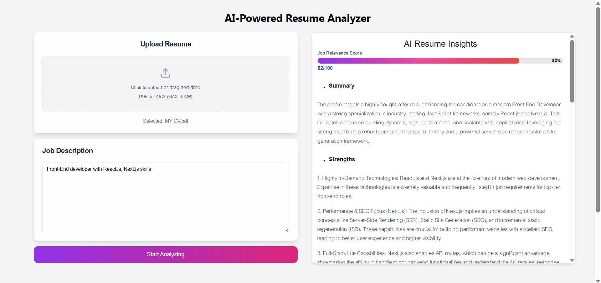

# AI Resume Analyzer 📄✨

A modern web application that helps job seekers analyze their resumes against job descriptions using artificial intelligence. Get instant feedback on how well your resume matches the position you're applying for.



## ⚡ Live Demo

Check out the live demo: [https://ai-powered-resume-analyzer-by-anaskhan.vercel.app/](https://ai-powered-resume-analyzer-by-anaskhan.vercel.app/)

## ✨ Features

- **Resume Upload**: Support for PDF and DOCX formats
- **Job Description Analysis**: Paste any job description for comparison
- **Smart Analysis**: Powered by Google's Gemini AI
- **Detailed Feedback**: Get insights on:
  - Key skills match and gaps
  - Experience relevance
  - Missing critical requirements
  - Suggested improvements
- **Clean UI**: Modern, responsive interface with elegant design

## 🛠️ Tech Stack

- React.js v18
- Javascript
- Tailwind CSS
- Custom Components

## 🚀 Getting Started

### Prerequisites
- React.js (v18 or higher)
- Google Gemini API key

### Frontend Setup
1. Clone the repository:
   ```bash
   git clone https://github.com/akanaskhan/AI-Powered-Resume-Analyzer.git
   ```

2. Install frontend dependencies:
   ```bash
   npm install
   ```

3. Run the development server:
   ```bash
   npm run dev
   ````

4. Create a `.env`:
   ```env
   GOOGLE_API_KEY=your_gemini_api_key_here
   ```


The application will be available at `http://localhost:5173`

## 📝 Usage

1. Upload your resume (PDF or DOCX format)
2. Paste the job description you're interested in
3. Click "Analyze"
4. Review the detailed analysis and suggestions
5. Make improvements to your resume based on the feedback

## 🔒 Privacy

- Files are processed locally and not stored
- Job descriptions are not retained after analysis
- No personal data is collected or storedt

## 📜 License

This project is licensed under the MIT License - see the [LICENSE](LICENSE) file for details.


## 📫 Contact

Anas Khan - [@yourtwitter](https://x.com/) - muhammadanaskhanak@gmail.com

Project Link: [https://github.com/akanaskhan/AI-Powered-Resume-Analyzer](https://github.com/akanaskhan/AI-Powered-Resume-Analyzer)